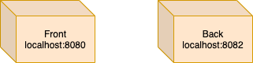

# devops-docker-actividad-1
 Actividad 1 de Docker en Diplomado DevOps Usach

## Introducción

El siguiente repositorio tiene como objetivo demostrar el uso de docker en un caso de despliegue de una aplicación web React y una API Rest Springboot

## Diagrama de despliegue



## Diagrama de componentes


## Aplicación Front: Aplicación Web React

- Imagen en base a httpd

### Dependencias

- httpd/Apache
- Git
- Node
- NPM

### Crear imagen

- Situarse en la carpeta contenedora de archivos del proyecto front

````bash
docker build -t actividad-front-imagen:v0.1 .
````

### Ejecutar imagen

- Ejecutar comando para construir el contenedor

```bash
 docker run --name actividad-front-contenedor -d -p 8080:80 actividad-front-imagen:v0.1
```

- Si no se especifica la versión de la imagen, irá por la versión latest
- Visitar url http://localhost:8080

### Ver aplicación web

- Visitar url en el navegador http://localhost:8080/index2.html

### Código fuente usado para la imagen front

- https://github.com/hernanBeiza/devops-calculadora-10-webapp

## Aplicación Backend: API Java

### Crear imagen

- Situarse en la carpeta contenedora de archivos del proyecto

````bash
docker build -t actividad-back-imagen:v0.1 .
````

### Ejecutar imagen

- Ejecutar comando

```bash
 docker run --name actividad-back-contenedor -d -p 8082:8082 actividad-back-imagen:v0.1
```

- Puerto 8082 está especificado en el código fuente de la aplicación Springboot en `application.properties`
- Si no se especifica la versión de la imagen, irá por la versión latest

### Revisar endpoint de prueba

- En postman, método GET
- Llamar a la siguiente url: http://localhost:8082/rest/mscovid/test?msg=Prueba

### Código fuente usado para la imagen backend

- https://github.com/kuroibatusai/ms-iclab


## Pendientes

- Comunicación entre contenedores desplegados
- Comunicación entre componentes de software

## Otros comandos útiles

### Entrar al contenedor via SSH

- Para revisar que los archivos hayan quedado bien copiados

````bash
docker exec -it <id contenedor> /bin/bash
````

### 